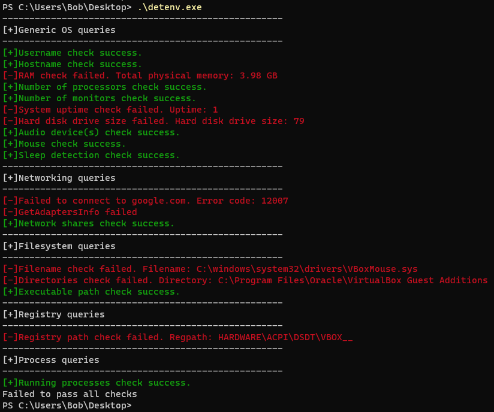

# detenv

## A small and portable Windows C library for sandbox detection

## Description

detenv is a small and portable library designed for Windows systems, purely written in C, which checks whether the environment that the executable is being run is a virtual machine or not. It exclusively relies on the Win32 API for all its system interactions and functionalities.

Note:
As of 02/10/2023, 9/72 security vendors in virustotal.com flagged it as malicious. This is logical since the techniques and Win32 API calls used, are heavily abused by real-world malware. detenv was created for VM detection and not AV evasion.

Disclaimer:
>This software is provided for educational purposes only. It is intended to demonstrate concepts and techniques related to computer security and should not be used for any malicious actions or illegal activities.

## How to use
In your Visual Studio project:
* Add the detenv.h header file
* Add the detenv.c source file
* Include "detenv.h" and call the detenv_all_checks() function to invoke all environmental checks

eg
	
	#include "detenv.h"

	int main() {

		if (detenv_all_checks()) {
			printf("All checks passed successfully\n");
		}
		else {
			printf("Failed to pass all checks\n");
		}

		return 0;
	}

To disable verbose messages, comment out the 4th line of the detenv.c file.

## Used cases
* Anti-Reverse Engineering: Protect software from being reverse-engineered in VMs.

* Malware Analysis: Identify suspicious behavior of malware attempting to evade detection in VMs.

## Key features

detenv does the following checks:

* **Generic checks**

> -check if username is specific to VMs

> -check if hostname is specific to VMs

> -check if total RAM is lower than 4 GB

> -check if number of processors is less than 2

> -check if there are any monitors

> -check if uptime of system is less than 5 minutes

> -check if hard disk drive size is less than 250 GB

> -check if there are any audio devices

> -check if mouse is present

> -check if sleep functionality is being skipped

* **Network checks**

> -check for internet connection

> -check for specific MAC address

> -check for specific network shares

* **Filesystem checks**

> -check for specific files

> -check for specific directories

> -check for specific strings in the executable path

* **Registry checks**

> -check for specific registry paths

* **process checks**

> -check for specific running processes

## References

https://evasions.checkpoint.com/

https://github.com/LordNoteworthy/al-khaser